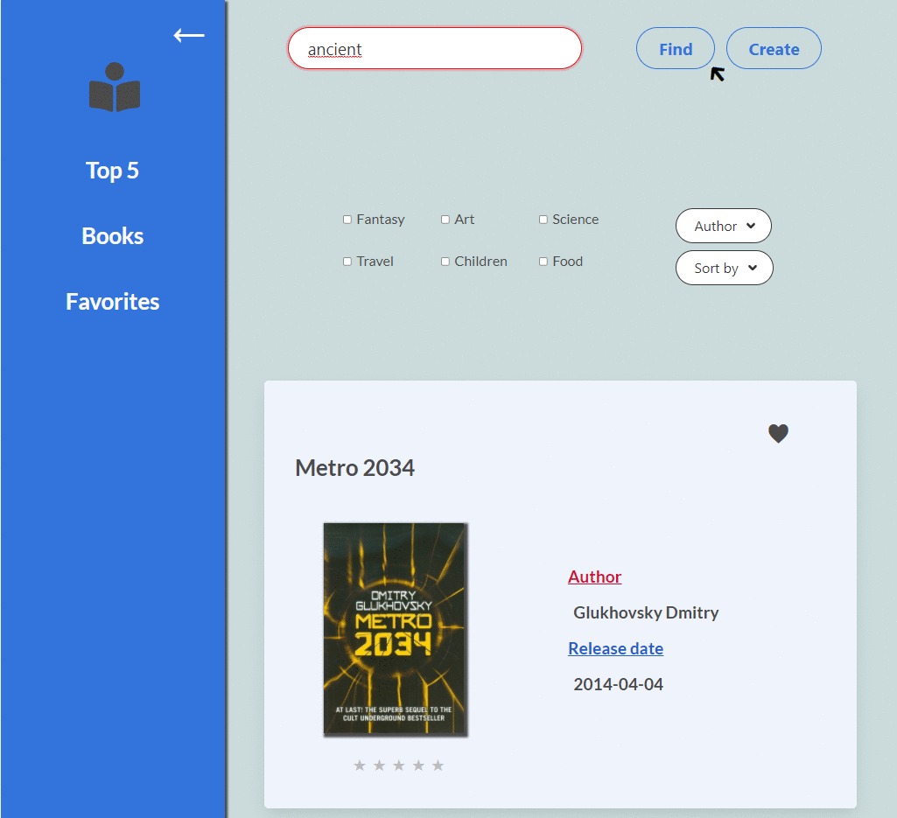
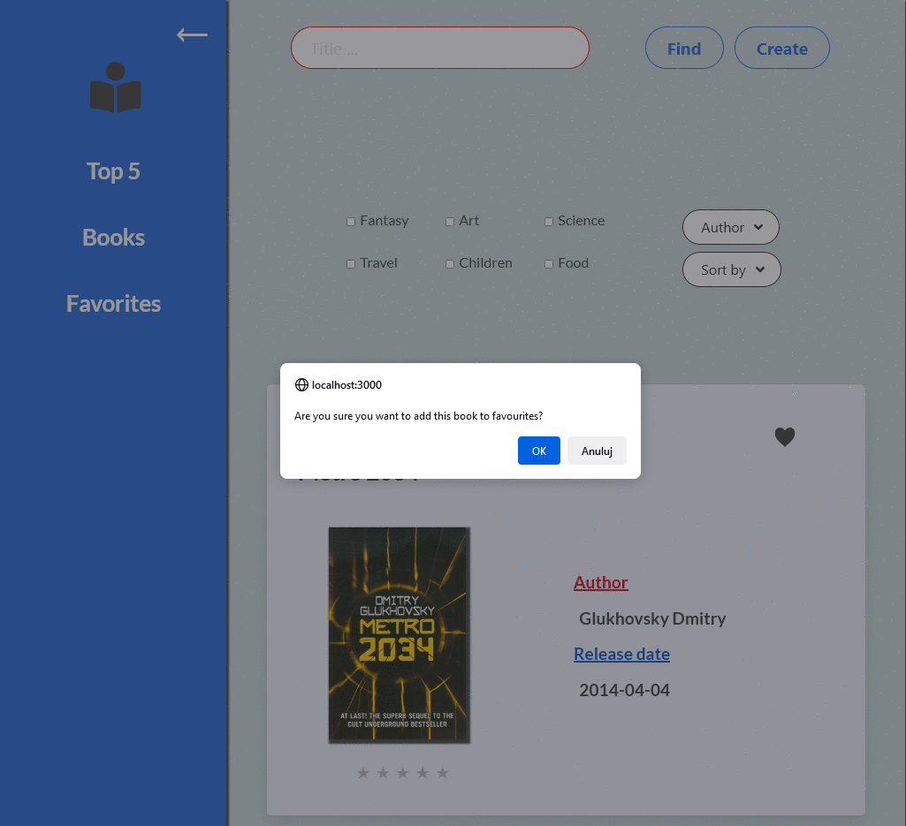

<h1>Book management</h1>

This is project of web application for Programming Language 2 at University Of Gdańsk , which present data about books. Data are fetched from API, which I had to use to create this app. 

<h2>App enables you to:</h2>
<ul>
<li>add, edit and delete books</li>
<li>search by title</li>
<li>filter by type or author</li>
<li>sort by alphabetical, date or rating</li>
<li>add to favourites</li>
<li>rate books</li>
<li>view top 5 the best rated books</li>
</ul>
<h2>Used:</h2>
<ul>
<li>React</li>
<li>Axios</li>
<li>React router</li>
<li>Formik</li>
<li>Bulma</li>
<li>Sass</li>
</ul>
<h2>Pagination, judge a book and edit panel</h2>

<h2>Search, sort, filter and create book</h2>

<h2>Add and remove favorites, top 5</h2>
